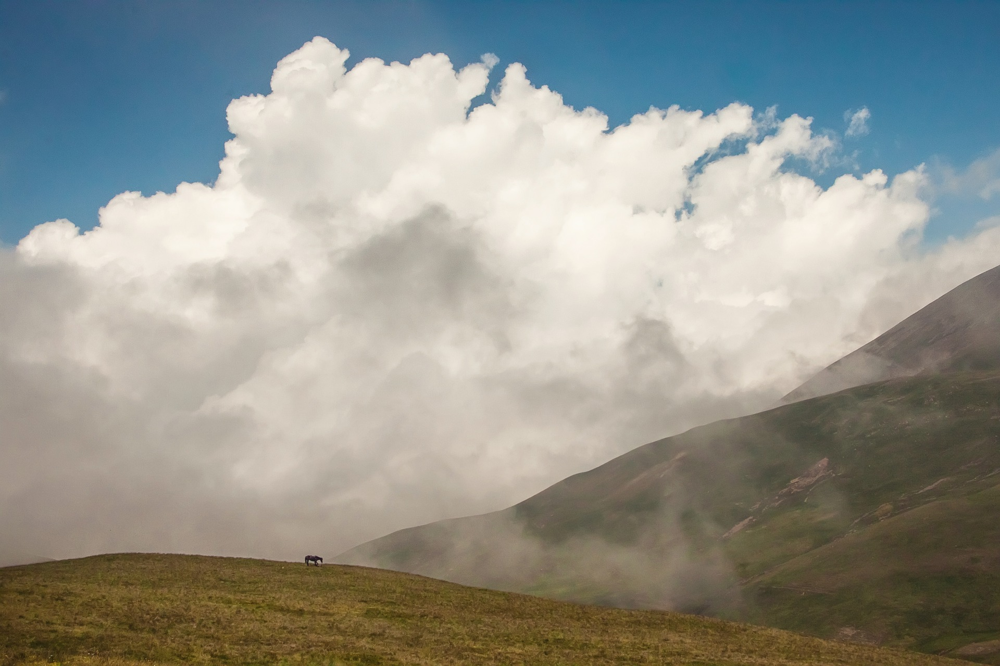

# Youtube Thumbnail Creator
With this package you are able to create a thumbnail with some optional features. I made a standard template which is used in a youtube channel for streams. If needed you can add more templates with the templates module (more information down below). First we concentrate on the common usecase.
# Classic Usage
Let's assume we have a basic picture: 
 
This picture is our base. We want to create 2 boxes with informations and add 2 images for video recommendation. To create