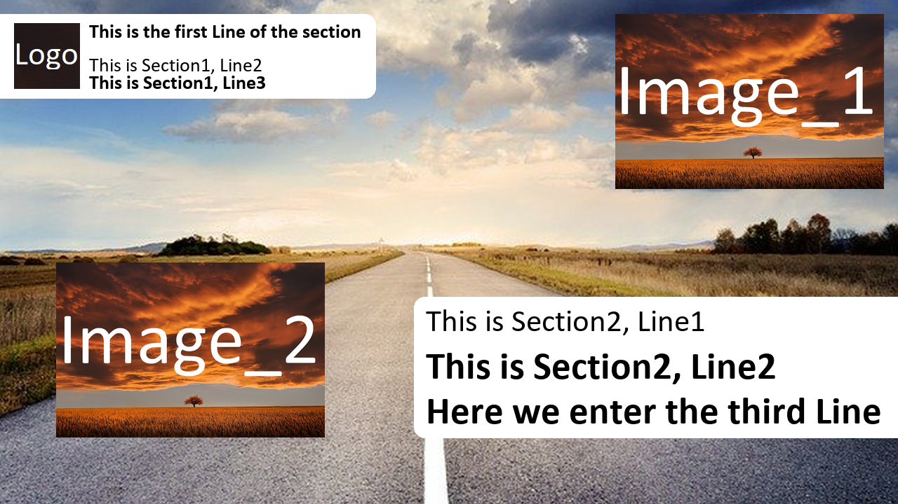

# Youtube Thumbnail Creator
With this package you are able to create a youtube thumbnail with some optional features. We use the pillow lirbary for the creation. I made a standard template which is used in a youtube channel for streams. If needed you can add more templates with the templates module (more information down below). First we concentrate on the common usecase. This is the general usage. For the template documentation you can browse the folder <strong>template_documentation</strong>. At the moment I created one template. I hope I can add more templates over time. 
# Quick Walkthrouh
Let's assume we have a basic image:<br />
<br />
This picture is our base. We want to create 2 boxes with informations and add 2 images. This components will be overlayed to the base image. With the following code...
```python
import os
from thumbnailcreation import ThumbnailCreation
import thumbnailcreation.templates as templates

picpath = os.path.join("examples", "example.jpg")
dst = os.path.join("examples", "mycoolthumbnail.png")
template = templates.classicBoxTemplate()
thumbnail = ThumbnailCreation(picpath, dst, template)

# Get the configuration
config = thumbnail.template.config
# Logo
config["logo"]["activate"] = True # Activate the section
config["logo"]["logopath"] = os.path.join("examples", "logo.jpg")

# Section 1
config["section_1"]["activate"] = True
config["section_1"]["line1_text"] = "This is the first Line of the section"
# Other lines can be accessed by line2_text and line3_text.

# Section 2
config["section_2"]["activate"] = True
config["section_2"]["line3_text"] = "Here we enter the third Line"
# Also the other lines accessed by line1_text and line2_text.

config["image_1"]["activate"] = True
config["image_1"]["imagepath"] = os.path.join("examples", "image_1.jpg")
config["image_2"]["activate"] = True
config["image_2"]["imagepath"] = os.path.join("examples", "image_2.jpg")
thumbnail.run(config)
```
... we can create the following image:<br />
<br />
When you continue reading we make a deep dive throu the code. If you have any questions feel free to ask. Enjoy reading!

# Classic Usage: Deep Dive
## Imports
We first import the needed modules.
```python
import os
from thumbnailcreation import ThumbnailCreation
import thumbnailcreation.templates as templates
```
## Creating the thumbnail object
After that we set the path to the base image. This is the only required parameter.
If the destinationpath is empty the output image is saved with an additional "1" at the end (example source: "test.jpg" / output: "test1.jpg"). Pillow can handle most endings.
The default template is the classicBoxtemplate. You can leave this empty if you want to use this one. Otherwise you pass the template function.

```python
picpath = os.path.join("examples", "example.jpg")
dst = os.path.join("examples", "mycoolthumbnail.png")
template = templates.classicBoxTemplate()
thumbnail = ThumbnailCreation(picpath, dst, template)
```
## Template Configuration
After the creation of the thumbnail object you have acces to the template configuration variables. You can activate the needed section and set the values. Usually the template handles the sizing and color. But sometimes you also can configure that. It depends on the template. With every template you have access to the following sections:
<ul>
<li>Logo (Image)</li>
<li>section_1 (Text section with three ines)</li>
<li>section_2 (Text section with three lines)</li>
<li>image_1 (Image)</li>
<li>image_2 (Image)</li>
</ul>
Every section can be accessed as a dictionary. After activating the section (default: False) you can provide the needed / wanted attributes. Text sections have a default text.

```python
# First we store the configuration in a variable
config = thumbnail.template.config
# Now you have access to the configurations

# Logo
config["logo"]["activate"] = True # Activate the section
config["logo"]["logopath"] = os.path.join("examples", "logo.jpg")

# Section 1
config["section_1"]["activate"] = True
config["section_1"]["line1_text"] = "This is the first Line of the section"
# Other lines can be accessed by line2_text and line3_text.

# Section 2
config["section_2"]["activate"] = True
config["section_2"]["line3_text"] = "Here we enter the third Line"
# Also the other lines accessed by line1_text and line2_text.

config["image_1"]["activate"] = True
config["image_1"]["imagepath"] = os.path.join("examples", "image_1.jpg")
config["image_2"]["activate"] = True
config["image_2"]["imagepath"] = os.path.join("examples", "image_2.jpg")
```
## Creating the thumbnail
The creating process is doing a few things:
<ul>
    <li><strong>Resizing the Image to the requested format</strong><br />
    The standard Youtube thumbnail size is 1280 * 720. This method resizes the image. If needed it crops the right size in the center. Afterwards the right destination path is calculated.</li>
    <li><strong>Add overlays</strong><br />
    This method calls the create_thumbnail method of the template. It requires the configuration</li>
    <li><strong>Check Size</strong><br />
    This method reduces the quality of the image if the filesize is too large for Youtube.</li>
</ul>
You can choose between calling the methods all one by one or just call the run method, which includes all three methods.

```python
# Calling the methods one by one
thumbnail.resize_pics()
thumbnail.add_overlays(config)
thumbnail.check_size()
# Or make the comfortable call
thumbnail.run(config)
```
The output is the image with the configurated settings which are overlayed to the basic image. The size is checked and it is ready to use.