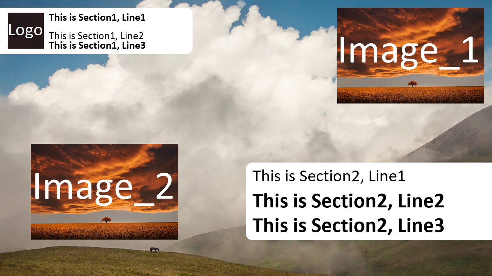
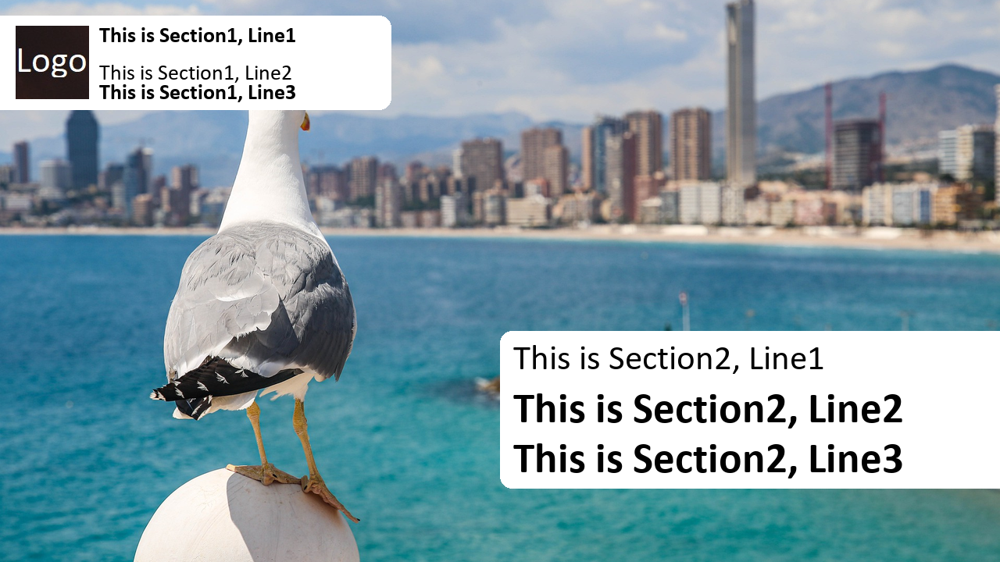
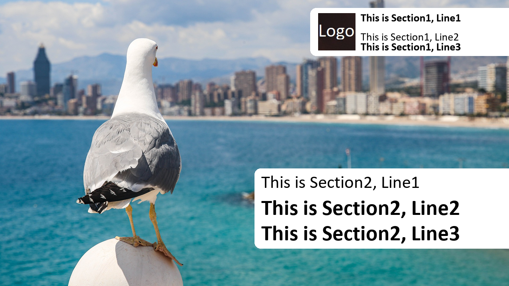
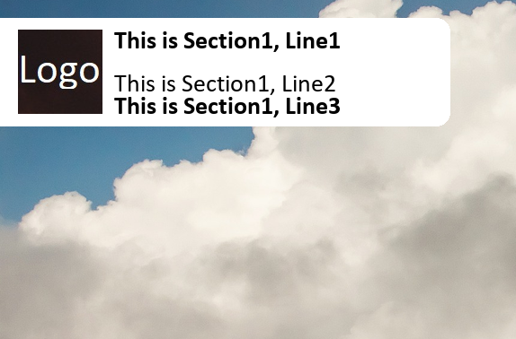
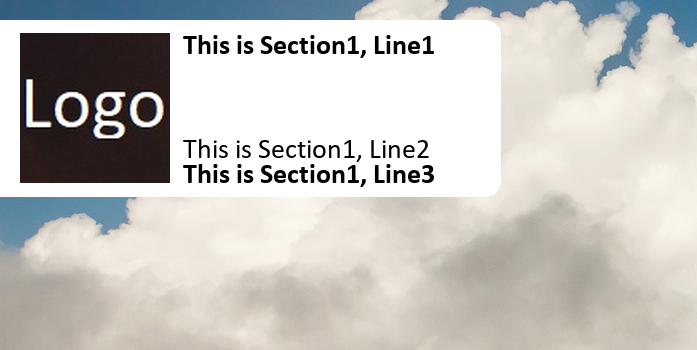
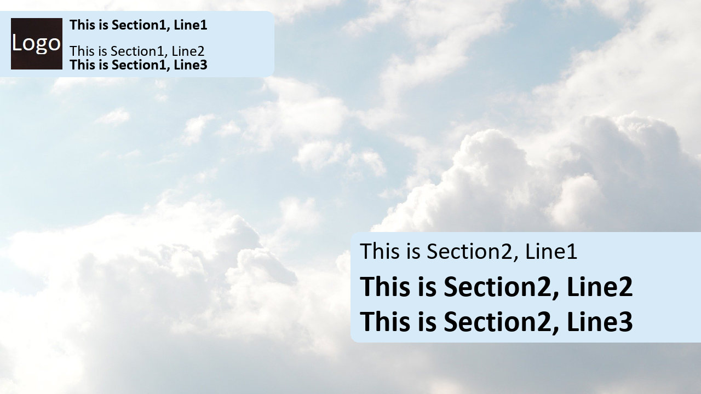
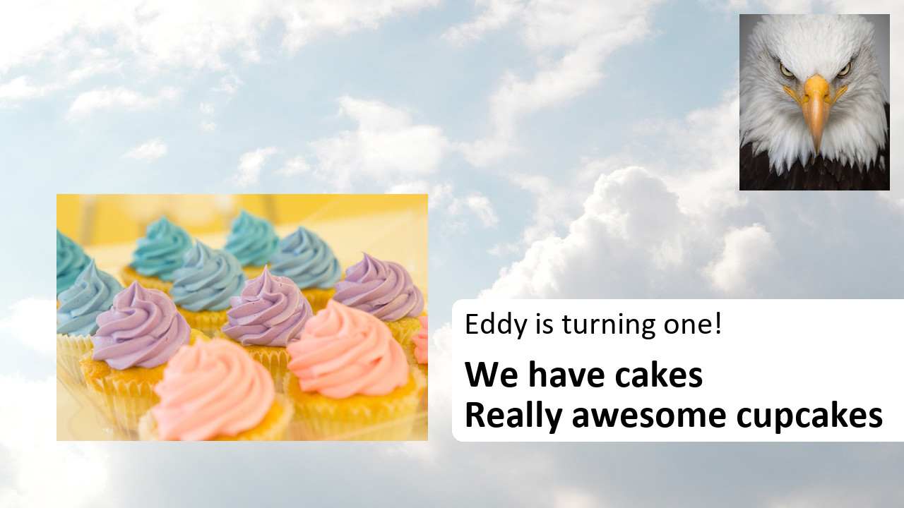

# The ClassicBoxTemplate
The Classix Box Template is the standard template for the ThumbnailCreation class. It has 2 textboxes (upper one with logo) and 2 images. All of them can be used individualy and can be styled.
When you just activate the 4 sections it looks like this:
<br />

# General information
## Order of creation
The order of creation is every time the same:
<ul>
    <li>image_1</li>
    <li>image_2</li>
    <li>section_1</li>
    <li>section_2</li>
</ul>
The reason is that text and images could overlap if the images or sections are too large. Because the text should be readable all the time this was the decision.

## Alignments
The standard horizontal alignments are:
<ul>
    <li>section_1: TopLeft</li>
    <li>image_1: TopRight</li>
    <li>image_2: BottomLeft</li>
    <li>section_2: BottomRight</li>
</ul>
The vertical alignments can be changed by modyfing the "boxside" attribute. If you change the side of one part you need to change the opposite as well if it is not requested to overlap sections. The boxside values are strings (right and left).

```python
# switching the sides of section_1
config["section_1"]["boxside"] = "right"
```
Here is an example where it makes sense to do that:<br />
<br />
The head of the seagull is covered and does not look nice. When we change the side to right we get a much better looking image.<br />
<br />

# Textboxes
The textboxes have a white background. It can be changed by entering the boxcolor attribute. You can type in the Pillow choosen colors or a hex code. Both has to be strings.
```python
# changing the boxcolor of section 1 and 2
config["section_1"]["boxcolor"] = "#FFFFFF"
config["section_2"]["boxcolor"] = "red"
```
## section_1
The section 1 has a top boxpadding of 20px and three lines in a black typeface. The font is calibri. Notice that line 1 and 3 are bold (calibrib). You can change each line font and face. For the face you need to type the name in windows/fonts on your machine. See the pillow documentation on https://pillow.readthedocs.io/en/stable/reference/ImageFont.html at the section PIL.ImageFont.truetype(). The font size works by design and can not be set (all 28pt).
```python
# changing font and color
config["section_1"]["line2_color"]= "green"
config["section_1"]["line2_font"]= "calibrib" # Bolt calibri
config["section_1"]["line3_color"]= "red"
config["section_1"]["line3_font"]= "times" # Times New Roman
```
### Logo
The logo is part of the section_1 textbox. When switched on it has a default minimum height of 94 and a maximum height of 150. Otherwise the text in the section looks a bit strange because there is too much white lines there. When the logo is activated it is vertical centered. The text is aligned with the logo dynamicly.<br />

<br />

## section_2
Section_2 has a smaller line1 (45pt). The other two lines are 55pt. It also can be styled individualy.
```python
config["section_1"]["boxcolor"] = "#fffdd0"
config["section_2"]["boxcolor"] = "#fffdd0"
```
When you have an almost white image this background for the box might work better.<br />
<br />

# Images
The images have a default maximum height of 250px and no minimum width and height. Feel free to play around with this values. They can be entered as integers.
```python
# changing maximum height of image_1
config["image_1"]["maximum_height"] = 500
```
Both images have the same top / bottom alignments as the textboxes. The bottom image has more side margin. It seems more present and should be used for more important information.<br />
<br />

Now enjoy and have fun with the template!